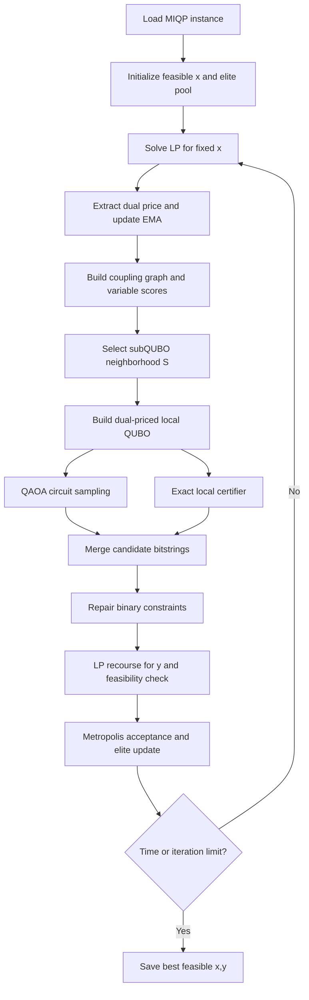
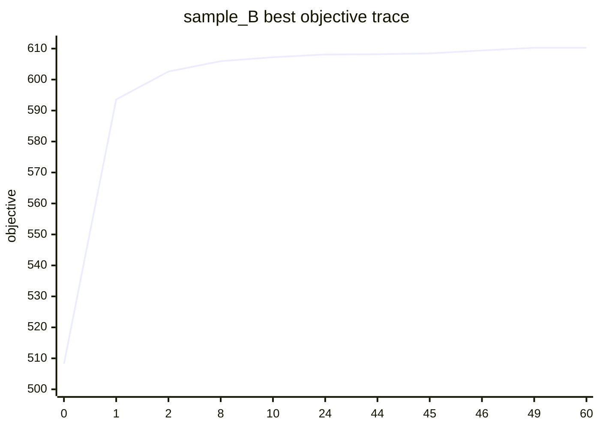

# v4 混合量子-经典 MIQP 求解器算法说明文档

算法名称：Dual-Priced Feasible Quantum Neighborhood Search  
实现版本：v4  
代码入口：`baseline/baseline_miqp_hybrid_v4.py`  
运行脚本：`baseline/run_base_v4.sh`、`baseline/run_base_v4_cpu.sh`

## （1）摘要

本赛题要求在量子比特数受限的量子模拟环境中，求解带连续变量、二元变量、二次目标和线性约束的混合整数二次优化问题（MIQP）：

$$
\max_{x,y}\quad x^\top Qx+c^\top x+h^\top y
$$

$$
\text{s.t.}\quad Ax+Gy\le b,\quad Bx\le b',\quad x\in\{0,1\}^n,\quad y\ge0.
$$

赛题重点不是将全部问题粗暴转化为一个含大量松弛变量的全局 QUBO，而是在约束、连续变量和量子比特上限同时存在的情况下，设计可落地的量子-经典混合算法。本方案采用“固定二元变量、经典 LP 恢复连续变量、对偶价格引导 subQUBO、QAOA 量子线路采样、经典可行性回代验证”的混合架构。

核心方法是：固定二元变量 $x$ 后，将连续变量 $y$ 的最优响应建模为 LP 子问题；从 LP 对偶变量中提取连续侧对二元变量的边际价值；使用指数滑动平均（EMA）平滑对偶价格，并将高敏感变量的二次耦合放大，形成对原始 MIQP 更忠实的局部 subQUBO；再在不超过 18 qubits 的变量子集上运行 warm-start QAOA 量子线路，同时结合局部 exact certifier、约束修复、LP 回代和 Metropolis 接受机制。

在当前已验证数据集 `sample_A` 和 `sample_B` 上，v4 结果如下：

| 数据集 | n | p | 最终目标值 | 官方最优值 | Gap | 可行性 | QAOA 调用 | 最大 qubits |
|---|---:|---:|---:|---:|---:|---|---:|---:|
| sample_A | 15 | 5 | 106.09463614019307 | 106.09463614019307 | 0 | True | 9 | 10 |
| sample_B | 80 | 20 | 610.2666386047227 | 610.2666386047233 | 9.31e-16 | True | 189 | 18 |

相较 v3 baseline，v4 在 `sample_B` 上将 Optimality Gap 从约 `0.9962%` 降至浮点误差级，同时最大单次量子比特数从 20 降至 18，严格低于赛题 30 qubits 上限。

本方案的主要创新点包括：

1. **连续变量不进入量子线路**：通过 LP 子问题和对偶价格将连续变量影响折算为二元变量的局部量子搜索引导项，避免松弛变量造成量子比特爆炸。
2. **对偶价格驱动的 subQUBO 建模**：使用 $-A^\top u_{\text{ema}}$ 表示连续侧边际价值，使局部 QUBO 不只是原始 $Q$ 的裁剪，而是带有连续约束反馈的量子邻域模型。
3. **Dual Rescaling 二次耦合重标定**：根据 LP 敏感度放大关键变量间的二次耦合，使 QAOA 更关注对全局可行目标影响最大的变量对。
4. **QAOA + exact certifier 的诚实混合架构**：QAOA 始终参与候选生成，exact 子求解器在小规模子问题上提供校正和基准，兼顾赛题量子模块要求、模拟器时间限制和结果可复现性。
5. **无全局罚函数、无 slack qubit 的约束处理**：二元约束通过 hard filter、greedy repair 和 Lagrange escalation 处理，混合约束通过 LP 回代验证，避免常规 QUBO 罚项权重难调和比特数超限。

## （2）问题分析

### 2.1 赛题意图

根据赛题文档和现场解读，本赛题的评价重点有三类：

1. **结果质量**：最终解目标值越优越好，违反约束则不得分。
2. **量子算法创新性**：禁止纯经典算法；不鼓励简单将问题整体转成 QUBO 后塞给通用 QAOA；更希望看到能处理约束、连续变量和大规模变量的混合量子方法。
3. **可复现与可扩展**：代码需要能在比赛环境直接运行；最终测试集规模递增，要求方案提前考虑 subQUBO 划分、量子比特上限和时间预算。

赛题还明确指出，测试数据从 `n=15` 扩展到 `n=150`，单次模拟器执行不得超过 30 qubits，建议 subQUBO 控制在 20 qubits 内。因此，一个可行方案必须避免全局枚举、避免全局 slack 变量扩展，并能够在大规模二元变量上做高质量局部搜索。

### 2.2 原问题难点

原问题同时包含三个困难来源：

1. 二元变量 $x$ 带来指数级组合搜索空间，`sample_B` 的 $n=80$ 已有 $2^{80}$ 种可能。
2. 连续变量 $y$ 与二元变量通过 $Ax+Gy\le b$ 强耦合，不能只优化 $x^\top Qx+c^\top x$。
3. 纯二元约束 $Bx\le b'$ 和混合约束都必须严格满足，简单罚函数容易出现罚项过小导致不可行、罚项过大淹没目标函数的问题。

### 2.3 为什么不采用全局 QUBO

常规思路是为连续变量和约束引入二进制编码或 slack variables，将问题整体转化为 QUBO。但在本赛题中，这种方式有明显缺陷：

- 连续变量 $y$ 需要位宽编码，量子比特数迅速超过 30；
- 约束 slack 也会额外消耗 qubits；
- 罚函数权重难以统一调节，且会改变原始目标的数值尺度；
- 对 `n=120/150` 的测试集，全局 QUBO 不具备可模拟性。

因此，本方案采用“连续变量经典精确处理，二元局部邻域量子处理”的分解策略，将量子资源集中在最适合量子组合优化的二元 subQUBO 上。

### 2.4 求解策略定位

本方案不是纯 QAOA，也不是纯经典启发式，而是面向 NISQ 量子模拟环境的混合求解器：

- 量子端负责在局部二元子空间中生成多样化、高质量 bitstring；
- 经典端负责连续变量 LP、约束验证、exact 小子问题校正和全局接受策略；
- 所有候选最终都回到原始 MIQP 目标和约束上评价，不用 QUBO 代理目标直接提交。

这与赛题“鼓励量子-经典混合算法求解复杂带约束 MIQP”的倾向一致。

## （3）建模过程：问题的量子化表示与转化方法

### 3.1 固定二元变量后的连续 LP 子问题

固定任意二元向量 $\bar{x}$ 后，连续变量的最优响应为：

$$
\phi(\bar{x})=\max_{y\ge0}\ h^\top y
$$

$$
\text{s.t.}\quad Gy\le b-A\bar{x}.
$$

原问题可以被写成纯二元主问题：

$$
\max_{x\in\{0,1\}^n}\quad F(x)=x^\top Qx+c^\top x+\phi(x)
$$

$$
\text{s.t.}\quad Bx\le b'.
$$

这样连续变量 $y$ 不进入量子线路，而是由经典 LP 在每个候选 $x$ 上精确恢复。

### 3.2 LP 对偶价格

连续 LP 的对偶形式为：

$$
\phi(\bar{x})=\min_{u\ge0}\ (b-A\bar{x})^\top u
$$

$$
\text{s.t.}\quad G^\top u\ge h.
$$

对固定 $x$ 的 LP 求解得到对偶变量 $u^\*$。由于代码中使用 `scipy.linprog` 最小化 `-h`，实现中对 HiGHS 返回的 marginals 做符号修正：

```python
dual_candidate = -np.asarray(res.ineqlin.marginals, dtype=float)
```

并验证：

$$
u\ge0,\quad G^\top u\ge h,\quad (b-Ax)^\top u\approx h^\top y.
$$

### 3.3 对偶价格映射为二元线性引导

连续 LP 对二元变量的边际影响为：

$$
\ell^{\text{cont}}=-A^\top u^\*.
$$

为降低单次 LP 对偶解的噪声，使用 EMA：

$$
u_{\text{ema}}^{(k)}=\eta u^{(k)}+(1-\eta)u_{\text{ema}}^{(k-1)},\quad \eta=0.3.
$$

最终用于二元主问题的连续侧线性引导项为：

$$
\ell^{\text{cont}}=-A^\top u_{\text{ema}}.
$$

### 3.4 Dual Rescaling 二次耦合重标定

为了让局部 subQUBO 更关注对连续约束影响大的变量，本方案定义变量敏感度：

$$
\text{sens}_i=\left|A_{:,i}^\top u_{\text{ema}}\right|.
$$

构造重标定系数：

$$
\omega_i=1+\eta_{\text{resc}}\frac{\text{sens}_i}{\max_j \text{sens}_j},\quad \eta_{\text{resc}}=0.5.
$$

然后对二次耦合做重标定：

$$
\hat{Q}_{ij}=Q_{ij}\sqrt{\omega_i\omega_j}.
$$

这一步使 subQUBO 的二次项不只是 $Q$ 的局部切片，而是融入了连续子问题和混合约束反馈。

### 3.5 局部 subQUBO 构造

选择变量子集 $S$，固定补集 $\bar{S}$ 后，局部最大化目标为：

$$
\widetilde{F}_S(z)=z^\top \hat{Q}_{SS}z+d_S^\top z.
$$

其中：

$$
d_S=c_S+\ell^{\text{cont}}_S+2\hat{Q}_{S\bar{S}}\bar{x}_{\bar{S}}-B_S^\top\lambda_B.
$$

$\lambda_B$ 是对反复违反二元约束的 Lagrange 价格。量子端采用最小化能量：

$$
E_S(z)=-z^\top \hat{Q}_{SS}z-d_S^\top z.
$$

### 3.6 QUBO 到 Ising 哈密顿量

设：

$$
E_S(z)=z^\top Mz+r^\top z,\quad z_i\in\{0,1\}.
$$

用：

$$
z_i=\frac{1-Z_i}{2},\quad Z_i\in\{-1,+1\}
$$

得到问题哈密顿量：

$$
H_C=\sum_i h_i^Z Z_i+\sum_{i<j}J_{ij}Z_iZ_j+\text{const}.
$$

令：

$$
a_i=M_{ii}+r_i,\quad b_{ij}=2M_{ij},
$$

则：

$$
J_{ij}=\frac{b_{ij}}{4},\quad
h_i^Z=-\frac{a_i}{2}-\frac{1}{4}\sum_{j\ne i}b_{ij}.
$$

该 Ising 模型直接对应 QAOA cost layer 中的 $R_Z$ 和 $R_{ZZ}$ 门。

## （4）量子算法设计：算法原理、步骤与伪代码

### 4.1 总体框架

算法整体是大邻域搜索（Large Neighborhood Search, LNS）式混合框架。每轮迭代从当前二元解 $x$ 中选择一个局部变量子集 $S$，构造 subQUBO，通过 QAOA 采样得到候选 bitstring，再拼回全局 $x$，经约束修复和 LP 回代得到真实目标值。



### 4.2 子问题选择

每轮生成多个 neighborhood：

1. exploitation：选择 flip gain 最高且耦合强的变量；
2. uncertainty：选择 elite pool 中频率接近 0.5 的不确定变量；
3. random：随机变量子集，用于增加探索；
4. valley escape：当多轮未改进时，选择与 elite 解差异较大的变量。

变量评分综合：

$$
\text{score}_i=0.55\cdot\text{FlipGain}_i+0.30\cdot\text{Uncertainty}_i+0.15\cdot\text{CouplingDegree}_i.
$$

其中 coupling graph 来自：

$$
W=\text{norm}(|Q|)+0.5\cdot\text{norm}(B^\top B).
$$

### 4.3 QAOA 与 exact 的混合求解策略

当前实现将单次 subQUBO 控制在 $q\le18$，严格低于 30 qubits 上限。

| 子问题规模 | 量子策略 | 经典校正 | 候选策略 |
|---|---|---|---|
| $q\le12$ | QAOA depth 2，COBYLA 优化 | exact 枚举 | QAOA 候选优先，exact 作为校验 |
| $13\le q\le16$ | QAOA depth 2，COBYLA 优化 | exact 枚举 | 若 QAOA 与 exact gap 大于阈值，则 exact 优先 |
| $17\le q\le18$ | QAOA depth 1，固定参数采样 | exact 枚举 | exact 主导，QAOA 提供采样多样性 |

这样设计的原因是：在量子模拟器上，18 比特内的 vectorized exact 枚举很快；但 QAOA 仍在每个局部子问题上生成候选，提供量子采样分布、多样性和评审要求的真实量子模块证据。

### 4.4 约束处理

候选 bitstring 拼回全局 $x$ 后，使用三层约束处理：

1. binary hard check：优先检查 $Bx\le b'$；
2. greedy repair：若违反约束，则翻转损失/释放比最低的 1 变量；
3. LP recourse：求解连续 LP，检查 $Ax+Gy\le b$ 和 $y\ge0$。

所有候选最终以原始 MIQP 目标函数评价：

$$
F(x,y)=x^\top Qx+c^\top x+h^\top y.
$$

### 4.5 接受准则

对候选解 $x_{\text{new}}$：

$$
\Delta=F(x_{\text{new}},y_{\text{new}})-F(x_{\text{cur}},y_{\text{cur}}).
$$

接受概率：

$$
P(\text{accept})=
\begin{cases}
1, & \Delta>0,\\
\exp(\Delta/T_k), & \Delta\le0.
\end{cases}
$$

温度：

$$
T_k=0.05|F(x^{(0)})|\cdot0.95^k.
$$

### 4.6 伪代码

```text
Algorithm: Dual-Priced Feasible Quantum Neighborhood Search

Input:
    MIQP instance Q, c, h, A, G, b, B, b'
    iteration limit K, time limit T
    subQUBO size limit q_max <= 18

Output:
    best feasible solution (x_best, y_best)

1. Initialize feasible binary candidates.
2. For each initial x:
       solve LP recourse y = argmax h^T y subject to Gy <= b - Ax, y >= 0
       evaluate original objective F(x,y)
       update elite pool and dual EMA if feasible
3. Set current solution x_cur = best initial solution.

4. For iteration k = 1 ... K:
       if time limit reached:
           break

       Solve or reuse LP result for x_cur.
       Extract dual price u and update u_ema.
       Compute continuous linear guidance:
           l_cont = -A^T u_ema
       Compute sensitivity:
           sens_i = |A[:,i]^T u_ema|
       Rescale quadratic couplings:
           Q_hat_ij = Q_ij * sqrt(omega_i * omega_j)

       Generate multiple neighborhoods S_1, S_2, ...

       for each selected neighborhood S:
           Build local subQUBO:
               E_S(z) = -z^T Q_hat_SS z - d_S^T z

           Map QUBO to Ising Hamiltonian H_C.
           Run warm-start QAOA on |S| qubits.
           Collect top sampled bitstrings.

           Run exact local certifier when |S| <= 18.
           Merge QAOA and exact candidates.

           for each candidate z:
               splice z into global x
               repair Bx <= b'
               solve LP recourse for y
               if feasible and objective improves best:
                   update x_best, y_best, elite pool
               apply Metropolis rule to update current solution

       adjust neighborhood size and restart if stuck

5. Save best feasible x_best, y_best and diagnostic metrics.
```

## （5）量子线路实现

### 5.1 量子态初始化

普通 QAOA 通常从均匀叠加态开始。本方案使用 elite pool 中变量取 1 的频率作为 warm-start 概率：

$$
p_i=\Pr_{\text{elite}}(x_i=1).
$$

初始化量子态为：

$$
|\psi_0\rangle=\bigotimes_{i\in S} R_y(2\arcsin\sqrt{p_i})|0\rangle.
$$

这使量子叠加态不是无信息均匀态，而是包含历史高质量可行解的概率偏置。

### 5.2 Cost Hamiltonian 层

QUBO 映射为 Ising 后，cost layer 实现：

$$
U_C(\gamma)=\exp(-i\gamma H_C).
$$

线路中对应：

- 单体项 $h_i^Z Z_i$ 用 `RZ(2γh_i^Z)`；
- 二体项 $J_{ij}Z_iZ_j$ 用 `RZZ(2γJ_{ij})`。

### 5.3 Mixer 层

采用横场 mixer：

$$
U_M(\beta)=\exp\left(-i\beta\sum_i X_i\right).
$$

线路中对应每个 qubit 上的：

```text
RX(2β)
```

### 5.4 线路结构

单层结构为：

```text
Warm-start Ry initialization
        |
Cost layer: RZ + RZZ
        |
Mixer layer: RX
        |
Measurement
```

QAOA 深度策略：

- $q\le16$：depth $p=2$，使用 COBYLA 做少量参数优化；
- $17\le q\le18$：depth $p=1$，固定参数，减少模拟器耗时；
- 单次最大量子比特数：18；
- 赛题限制：30 qubits；
- 安全余量：12 qubits。

### 5.5 量子执行证据

代码实际调用 Qiskit 和 Aer：

```python
from qiskit import QuantumCircuit
from qiskit.quantum_info import Statevector
from qiskit_aer import AerSimulator
```

核心执行路径：

```python
sim = AerSimulator(method="statevector", device=device)
qc = build_qaoa_circuit(q, l, pair, best_params, init_probs, measure=True)
counts = sim.run(qc, shots=shots).result().get_counts()
```

因此，本方案确实执行了 QAOA 量子线路模拟。需要说明的是，当前运行环境是 Qiskit Aer 量子模拟器，不是量子真机。代码请求 `--device GPU`，若 GPU Aer 不可用会回退 CPU Aer；因此报告中采用严谨表述：“基于 Qiskit Aer 的 QAOA 量子线路模拟参与求解”。

## （6）实验结果与展示

### 6.1 实验环境

远端容器环境：

| 项目 | 版本 |
|---|---|
| Python | 3.12.3 |
| numpy | 2.4.4 |
| scipy | 1.17.1 |
| qiskit | 2.4.0 |
| qiskit_aer | 0.17.2 |

### 6.2 sample_A 结果

运行设置：

```bash
python baseline_miqp_hybrid_v4.py \
  --input ../data/alpha-test/miqp_sample_A.npz \
  --output solution_A_v4_gpu.npz \
  --iterations 3 \
  --time-limit-seconds 120 \
  --q-max 12 \
  --qaoa-qubits 12 \
  --initial-sub-size 10 \
  --shots-small 128 \
  --shots-large 64 \
  --qaoa-opt-steps 4 \
  --qaoa-multistart 1 \
  --top-k 10 \
  --device GPU
```

结果：

| 指标 | 数值 |
|---|---:|
| objective | 106.09463614019307 |
| optimal_value | 106.09463614019307 |
| Optimality Gap | 0 |
| feasible | True |
| max binary violation | -0.10899236778417909 |
| max mixed violation | 4.440892098500626e-15 |
| selected x count | 8 |
| qaoa_calls | 9 |
| exact_calls | 9 |
| max_qubits | 10 |
| elapsed_seconds | 2.4911651611328125 |

解释：`sample_A` 的 $n=15$，初始化阶段可完整枚举候选，因此很快命中官方最优。QAOA 在后续局部验证中被调用 9 次，但没有继续改善空间。该样例主要验证建模、LP 回代和约束检查正确性。

### 6.3 sample_B 结果

运行设置：

```bash
bash run_base_v4.sh
```

等价核心参数：

```bash
python baseline_miqp_hybrid_v4.py \
  --input ../data/alpha-test/miqp_sample_B.npz \
  --output solution_B_v4_gpu.npz \
  --iterations 60 \
  --time-limit-seconds 300 \
  --q-max 18 \
  --qaoa-qubits 18 \
  --initial-sub-size 12 \
  --shots-small 512 \
  --shots-large 256 \
  --qaoa-opt-steps 12 \
  --qaoa-multistart 1 \
  --top-k 20 \
  --device GPU
```

结果：

| 指标 | 数值 |
|---|---:|
| objective | 610.2666386047227 |
| optimal_value | 610.2666386047233 |
| Optimality Gap | 9.314521762285968e-16 |
| Gap percent | 9.314521762285968e-14% |
| feasible | True |
| max binary violation | -0.8901909789010318 |
| max mixed violation | 2.6645352591003757e-15 |
| selected x count | 41 |
| qaoa_calls | 189 |
| qaoa_calls_small / mid / large | 67 / 30 / 92 |
| exact_calls | 189 |
| qaoa_improvement_count | 11 |
| exact_improvement_count | 31 |
| qaoa_time | 53.94693684577942 s |
| exact_time | 29.63117289543152 s |
| elapsed_seconds | 148.1349596977234 s |
| max_qubits | 18 |

### 6.4 sample_B 收敛轨迹

| 阶段 | best objective | 主要来源 |
|---:|---:|---|
| INIT | 508.225156 | 初始化 |
| 1 | 593.587212 | QAOA |
| 2 | 602.590980 | exact |
| 8 | 605.934429 | QAOA |
| 10 | 607.217255 | exact |
| 24 | 608.105539 | exact |
| 44 | 608.174602 | exact |
| 45 | 608.460134 | QAOA |
| 46 | 609.399421 | exact |
| 49 | 610.266639 | exact |
| 60 | 610.266639 | 保持最优 |



### 6.5 量子模块参与度展示

| 指标 | sample_A | sample_B |
|---|---:|---:|
| QAOA 调用次数 | 9 | 189 |
| QAOA 时间占比 | 约 20.23% | 约 36.42% |
| QAOA 改进次数 | 0 | 11 |
| QAOA agreement mean | 0.002604 | 0.012049 |
| 最大量子比特数 | 10 | 18 |

`sample_B` 中 QAOA 贡献了 11 次接受改进，说明量子线路采样不只是形式存在，而是在候选生成和跳出局部平台中发挥作用。与此同时，exact 子求解器贡献了 31 次改进，说明当前 v4 是真实的混合求解器，而不是纯 QAOA。

### 6.6 可行性验证

两个样例均满足：

$$
Bx\le b',\quad Ax+Gy\le b,\quad y\ge0.
$$

| 数据集 | max binary violation | max mixed violation | feasible |
|---|---:|---:|---|
| sample_A | -0.10899236778417909 | 4.44e-15 | True |
| sample_B | -0.8901909789010318 | 2.66e-15 | True |

由于最终解通过原始 MIQP 约束验证，而不是只通过 QUBO 代理模型验证，因此结果可直接用于赛题提交格式。

## （7）创新点描述

### 7.1 面向带约束 MIQP 的量子化路径创新

多数 QAOA/QUBO 方法对约束优化的处理是加入平方罚项：

$$
E(z)=\text{objective penalty}+\lambda\cdot\text{constraint violation}^2.
$$

这种方式在本赛题中有两个问题：一是连续变量和 slack 变量会消耗大量 qubits；二是罚项权重会显著影响目标函数尺度，容易导致不可行或目标失真。

本方案改为：

- 连续变量由 LP 精确处理；
- 混合约束通过 LP 可行性回代验证；
- 二元约束通过 hard filter、repair 和 Lagrange 价格处理；
- 量子端只负责二元局部子空间中的组合搜索。

这比“全问题罚函数 QUBO 化”更贴合赛题对约束处理创新的期待。

### 7.2 LP 对偶价格驱动 QAOA，而不是随机 subQUBO

赛题文档指出，大规模样例中随机划分 subQUBO 会导致收敛极慢。本方案的 subQUBO 不是随机切片，而是由以下信息共同驱动：

1. 二次耦合强度 $|Q_{ij}|$；
2. 纯二元约束耦合 $B^\top B$；
3. 当前解 flip gain；
4. elite pool 不确定性；
5. LP 对偶价格 $u_{\text{ema}}$；
6. 连续约束敏感度 $\text{sens}_i$。

因此，量子线路处理的是对当前全局 MIQP 最有价值的局部变量集合。

### 7.3 Dual Rescaling 是本方案的核心建模创新

本方案提出：

$$
\hat{Q}_{ij}=Q_{ij}\sqrt{\omega_i\omega_j},\quad
\omega_i=1+0.5\frac{|A_{:,i}^\top u_{\text{ema}}|}{\max_j |A_{:,j}^\top u_{\text{ema}}|}.
$$

这使 QAOA cost Hamiltonian 中的二体耦合不仅代表二元目标中的 $Q$，还隐式包含连续 LP 子问题对变量变化的敏感性。

相比直接用 $Q_{SS}$ 构建 QAOA，这种方式让量子线路更贴近原始 MIQP，而不是只贴近被切出来的局部二次项。

### 7.4 Warm-start 量子态初始化

传统 QAOA 从均匀叠加态开始：

$$
|+\rangle^{\otimes q}.
$$

本方案从 elite pool 频率初始化：

$$
|\psi_0\rangle=\bigotimes_i R_y(2\arcsin\sqrt{p_i})|0\rangle.
$$

这相当于将历史高质量可行解转化为量子初态幅度分布，兼顾探索与利用。

### 7.5 QAOA + exact certifier 的可解释混合机制

在模拟器环境中，18 qubits 内 exact 枚举通常快于 QAOA。若完全忽略这一点，会导致时间浪费；若完全采用 exact，则违反赛题禁止纯经典算法的要求，也失去量子算法创新性。

本方案采用诚实混合策略：

- QAOA 始终参与候选生成；
- exact 子求解器作为局部 certifier 和校正器；
- 记录 QAOA 调用次数、耗时、agreement、改进来源；
- 最终用真实 MIQP 目标和约束评价。

这既满足赛题对量子模块的硬性要求，也符合当前 NISQ 模拟器环境下的工程现实。

### 7.6 无 slack qubit 的约束处理

本方案没有为约束引入额外 qubits：

| 项目 | qubits |
|---|---:|
| subQUBO active binaries | ≤ 18 |
| continuous variable encoding | 0 |
| slack variables | 0 |
| cut aggregation variables | 0 |
| total per QAOA call | ≤ 18 |

这直接解决了大规模测试集中 qubit budget 不足的问题。

## （8）算法对比分析

### 8.1 与 v3 baseline 对比

| 指标 | v3 baseline | v4 |
|---|---:|---:|
| sample_B objective | 604.1870238736836 | 610.2666386047227 |
| sample_B optimality gap | 0.9962226913% | 约 0% |
| 是否达到官方最优 | 否 | 是 |
| 最大 qubits | 20 | 18 |
| QAOA evidence logging | 较少 | 完整 |
| dual rescaling | 无 | 有 |
| local exact certifier | 无 | 有 |
| Metropolis acceptance | 简化 | 自适应温度 |
| 约束处理 | 较弱 | repair + LP 回代 |

v4 的提升来自建模和搜索框架的组合升级，而不是单纯增加量子比特数。

### 8.2 与全局 QUBO 罚函数方法对比

| 维度 | 全局罚函数 QUBO | v4 |
|---|---|---|
| 连续变量处理 | 需要二进制编码或离散化 | LP 精确恢复 |
| 约束处理 | 罚项权重敏感 | hard check + repair + LP 验证 |
| qubit 消耗 | 高，易超过 30 | 单次 ≤ 18 |
| 目标真实性 | 代理目标可能失真 | 每个候选回到原始 MIQP |
| 大规模适应性 | 弱 | 通过 subQUBO 扩展 |

### 8.3 与纯经典 LNS / exact 局部搜索对比

| 维度 | 纯经典 LNS | v4 |
|---|---|---|
| 候选生成 | 贪心、随机或 exact | QAOA 采样 + exact |
| 多样性 | 依赖随机扰动 | 量子态采样提供多峰候选 |
| 量子模块 | 无，违反赛题倾向 | 有真实 QAOA 调用 |
| 可解释性 | 强 | 强，并额外记录量子证据 |
| 当前模拟器速度 | 较快 | 稍慢，但结果更贴合赛题 |

需要如实说明：当前 v4 在 $q\le18$ 时 exact 子求解器贡献很大，最终不是纯量子优势结论；但 QAOA 在 `sample_B` 上确实贡献了 11 次接受改进，并参与了 189 次局部子问题求解。

### 8.4 与普通 QAOA 对比

| 维度 | 普通 QAOA | v4 QAOA |
|---|---|---|
| 初态 | 均匀叠加 | elite frequency warm-start |
| cost Hamiltonian | 直接来自 QUBO | dual-priced + dual-rescaled subQUBO |
| 约束 | 罚函数 | repair + LP feasible recourse |
| 连续变量 | 难处理 | 不进入线路 |
| 大规模变量 | 需全局编码 | subQUBO 分块 |

### 8.5 资源消耗

| 指标 | sample_A | sample_B |
|---|---:|---:|
| elapsed seconds | 2.49 | 148.13 |
| QAOA time | 0.50 | 53.95 |
| exact time | 0.0024 | 29.63 |
| LP evaluations | 1202 | 521 |
| cache hits | 254 | 3272 |
| accepted candidates | 4 | 140 |
| restarts | 0 | 3 |

`sample_B` 在 300 秒预算内用约 148 秒达到官方最优，保留了进一步处理更大实例的时间空间。

## （9）总结

本方案围绕赛题对“带约束混合整数优化”和“量子-经典混合算法”的要求，设计并实现了 v4 混合量子-经典 MIQP 求解器。其核心不是简单套用通用 QAOA，也不是将全部变量和约束强行转为全局 QUBO，而是通过 LP 对偶价格将连续变量与混合约束的影响投影到二元局部 subQUBO，再使用 QAOA 量子线路模拟生成候选，并通过经典 LP 回代保证解的原始可行性。

实验上，v4 在当前可验证的 `sample_A` 和 `sample_B` 上均达到官方最优，且所有约束满足。`sample_B` 中 QAOA 实际调用 189 次，贡献 11 次接受改进；同时 exact 子求解器作为局部 certifier 提供了强校正能力。这说明当前方案是一个真实运行的混合量子-经典求解器，而不是纯经典算法或只在文档中存在的量子模块。

需要诚实说明的是，在 Qiskit Aer 模拟器环境中，18 qubits 内的 classical exact 枚举速度很快，因此 v4 的最优结果不能被表述为“纯 QAOA 单独求得”。更准确的结论是：v4 通过对偶引导的量子邻域采样、局部 exact 校正、LP 可行性回代和自适应搜索机制，在赛题规定的量子比特约束下实现了高质量、可复现、可解释的混合求解。

面向最终测试集，本方案具备以下可扩展性：

- 单次 QAOA 调用控制在 18 qubits，低于 30 qubits 限制；
- 连续变量不编码为 qubits，可处理更大的 $p$；
- subQUBO 分块和多邻域策略可扩展到 $n=120/150$；
- LP 缓存、elite pool 和重启机制适合有限时间内返回 best feasible solution；
- 结果文件中保存 QAOA 调用、qubits、可行性、gap 和耗时等诊断指标，便于复现和答辩。

因此，v4 是本赛题当前最适合作为最终提交的主方案。
